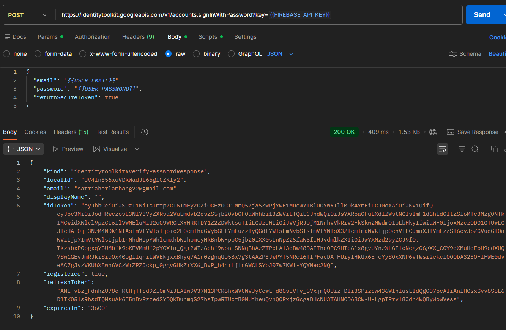
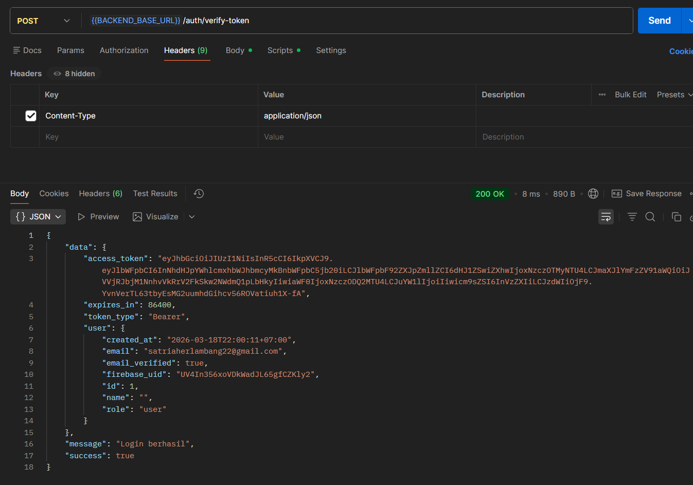
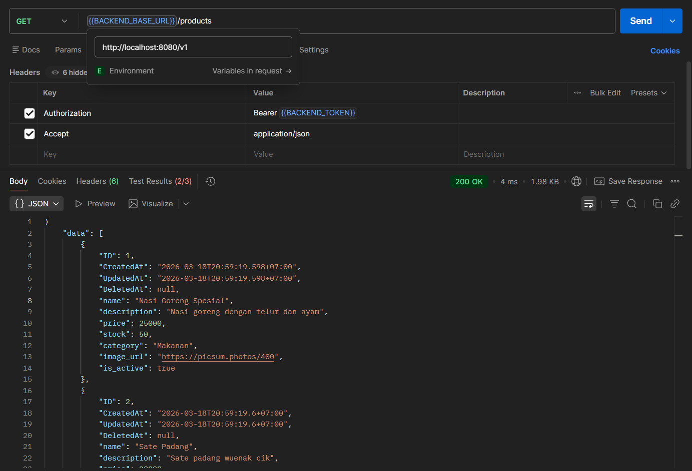
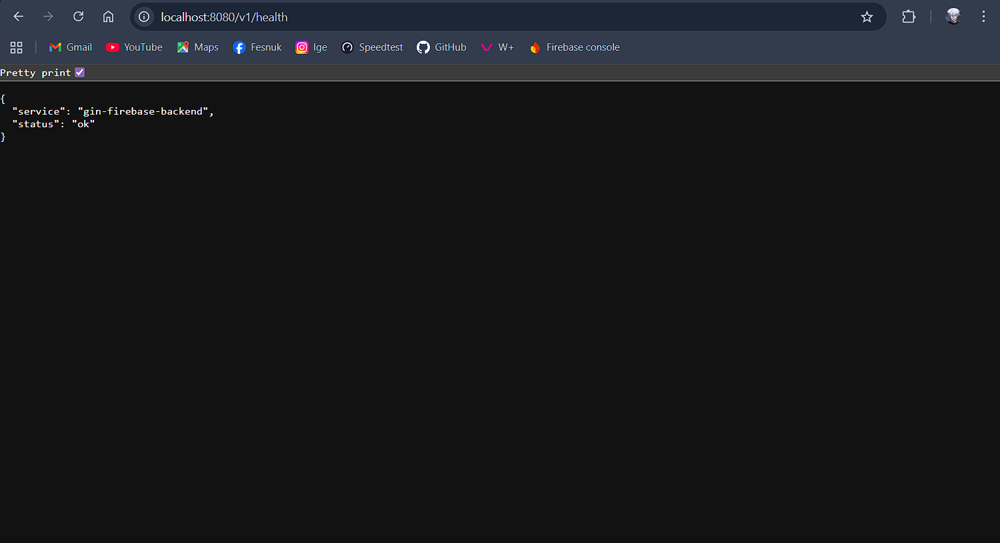
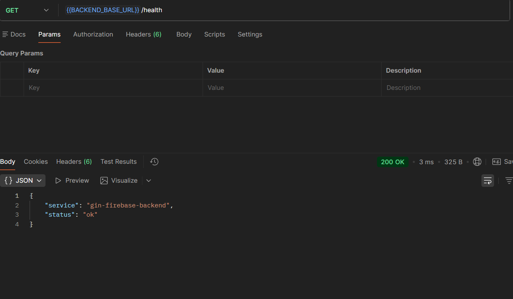
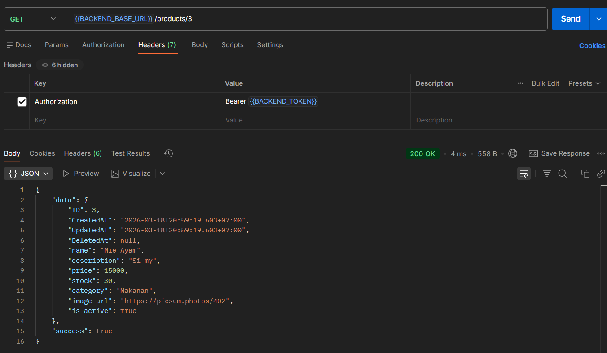
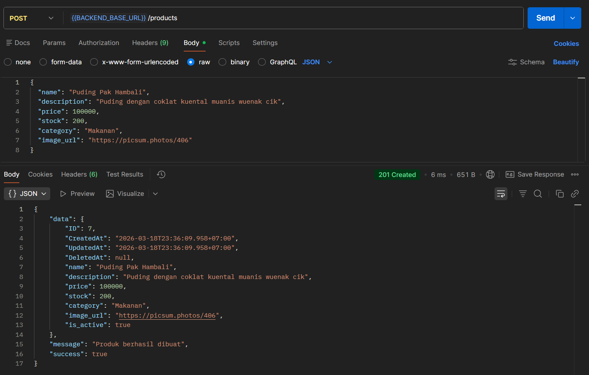
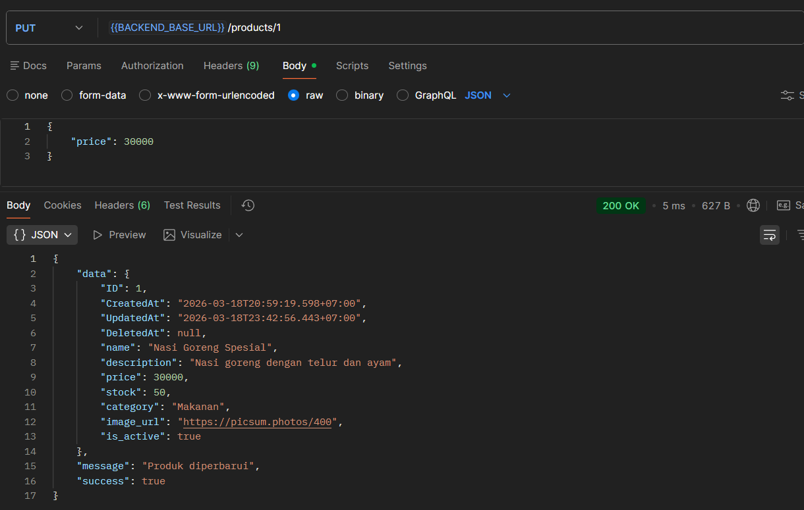
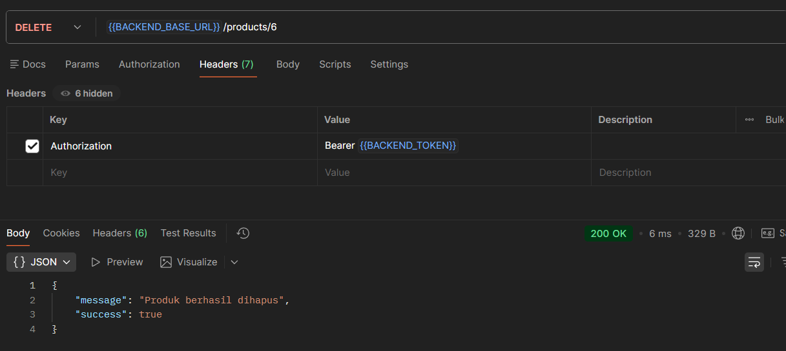

# Tugas Week 5 - Backend API Golang

Repositori ini berisi implementasi backend Restful API menggunakan Golang, Gin framework, GORM, dan MySQL. Backend ini juga terintegrasi dengan Firebase Authentication.

## 🛠️ Tech Stack
- **Bahasa:** Go (Golang)
- **Framework:** Gin Web Framework
- **ORM:** GORM
- **Database:** MySQL
- **Authentication:** Firebase Admin SDK & JWT

## 🚀 Fitur Utama
1. **Verifikasi Token Firebase:** Menukar Firebase ID Token menjadi Backend JWT Access Token.
2. **Middleware Otorisasi:** Melindungi endpoint menggunakan validasi JWT (Bearer).
3. **CRUD Produk:** Endpoint lengkap (GET, POST, PUT, DELETE) untuk mengelola data produk.

## ⚙️ Cara Menjalankan Project Lokal

### Langkah-langkah Setup
1. **Clone repositori ini**
   ```bash
   git clone [https://github.com/str122-xyz/Week-5.git](https://github.com/str122-xyz/Week-5.git)
   cd Week 5
   ```

2. **Buat Database MySQL:**
Buat database bernama gin_app dan user ginuser (password: GinPass@123).

3. **Konfigurasi Environment:**
Buat file .env dan isi dengan konfigurasi database serta JWT Secret Anda.

4. **Tambahkan Firebase Credential:**
Letakkan file firebase-service-account.json di dalam root project.

5. **Install Dependencies**
```Bash
go mod tidy
```

6. **Jalankan Seeder**
```Bash
go run seed/seed.go
```

7. **Jalankan Server**
```Bash
go run main.go
```

## 📡 Dokumentasi Endpoint

### 1. Login



### 2. Tukar Firebase Token ke Backend JWT



### 3. Daftar Semua Produk



### 4. Cek Status dan Server





### 5. Detail 1 Produk



### 6. Create Produk Baru



### 7. Update Produk



### 8. Delete Produk

